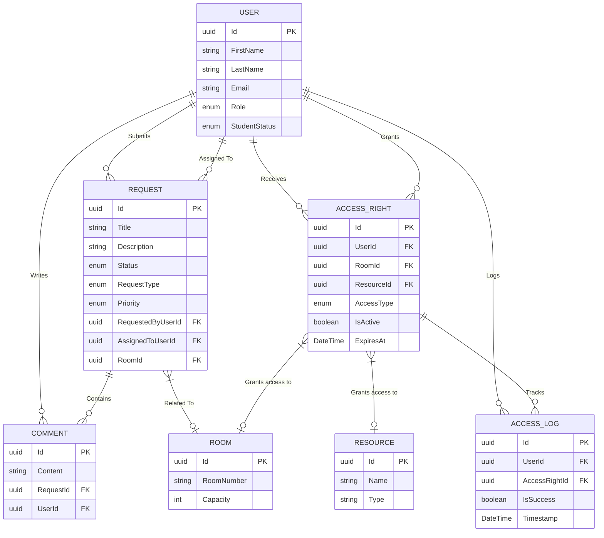

# Studentski Dom (Student Dormitory Management System)

A comprehensive management system for student dormitories, encompassing access rights, requests/complaints handling, and facility administration.

## 🌟 Features
- **User Authentication**: Role-based access control (Student, Admin, Staff).
- **Access Management**: Control physical access to rooms, networks, and building facilities.
- **Request Management**: Submit and track status of maintenance, inventory replacement, or document requests.
- **Reporting**: Full visibility for administration staff over students, rooms, and access logs.

## 💻 Tech Stack
- **Backend**: C# .NET 10, ASP.NET Core Web API, Entity Framework Core 
- **Database**: PostgreSQL (deployed via Docker Compose)
- **Frontend**: Next.js, React, Tailwind CSS

## 📊 Entity Relationship Diagram



## 🚀 Getting Started

### Infrastructure (Database)
Requires Docker Desktop installed and running.
```bash
docker-compose up -d
```

### Backend
Navigate to `backend/src/StudentskiDom.API` and start the server:
```bash
dotnet run
```
Provides the Swagger UI at `http://localhost:5104/swagger`.

### Frontend
Navigate to the `frontend` folder, install dependencies, and run:
```bash
npm install
npm run dev
```
Navigate to `http://localhost:3000`.

Email: admin@studentskidom.ba (ili staff@studentskidom.ba za tehničara)
Lozinka: Admin123! (respektivno Staff123!)